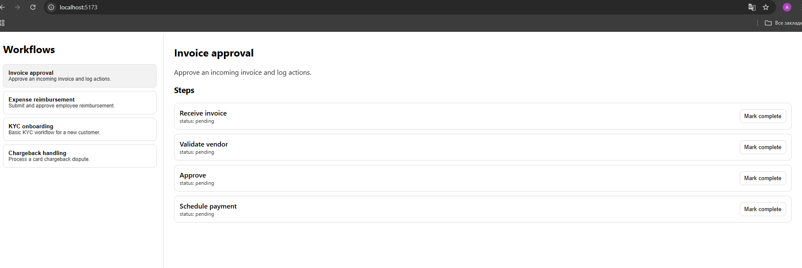

# Finance Workflows Dashboard (React + Vite)

Demo UI for business/finance workflows. Shows workflow list, steps, and allows marking steps as completed via REST API.

## Features

- Workflow list (left)
- Workflow details + steps (right)
- "Mark complete" updates backend and refreshes UI
- Configurable API base URL via `.env`

## Tech Stack

- React + Vite + TypeScript
- REST интеграция с FastAPI backend

## Setup

```bash
npm install
cp .env.example .env
npm run dev
```

## API

front https://finance-workflows-homejob-lzgia5tah-alexs-projects-cb770374.vercel.app/

Endpoints used:

- `GET /workflows`
- `POST /workflows/{workflow_id}/steps/{step_id}/complete`
## Screenshots




